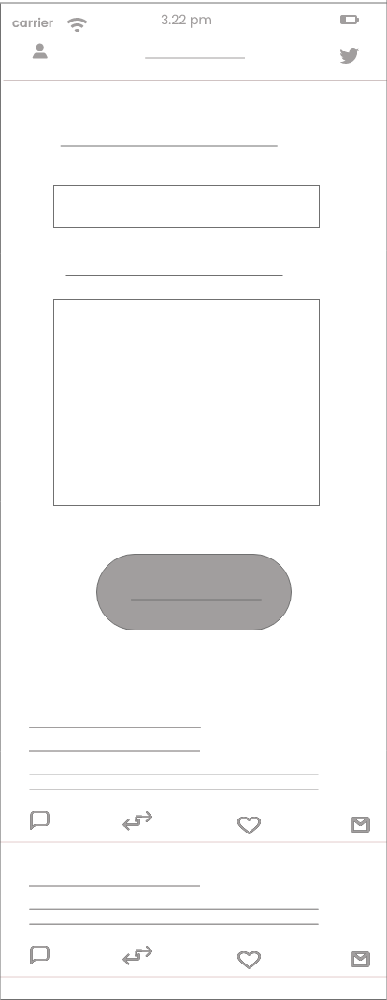
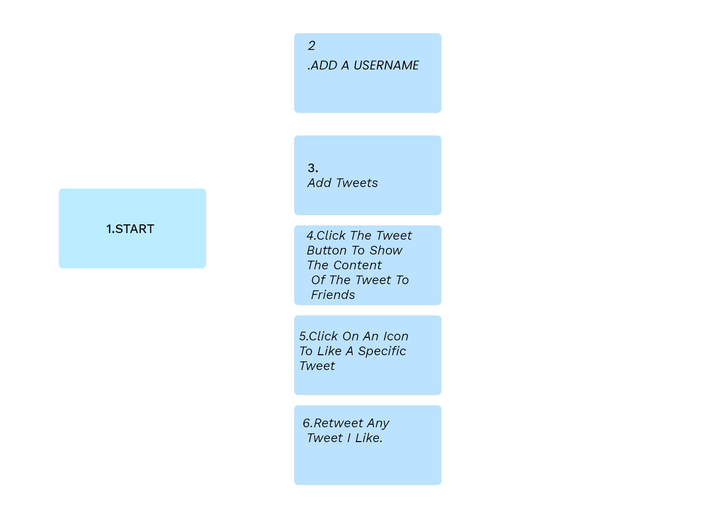

# Twitter-Clone-Rawan
The one who created this app : [Rawan zaqout](https://github.com/Rawanzaqout)
## ✧Description
A simple Twitter clone application created to simulate the basic design and functionality of the official Twitter app. The demo app has a home screen - it contains a username and tweet details
# ✧links:

[live link](https://gsg-fc03.github.io/Twitter-Clone-Rawan/)

[design link](https://www.figma.com/file/H1umAr6TRvHjiU1JnkmfLH/Untitled?node-id=0%3A1)

## ✧The wireframes ( The initial screen)
 

## ✧User journey
The user enters the app and adds their username and tweet to the input .

When you click the Tweet button, the tweet content will appear to your friends .

You can click on the like icon for any tweet you like .

You can click the retweet button to any tweet you like.

## ✧User Story

- As a user, I can add a username
- As a user, I can add tweets
- As a user, I can click the tweet button to show the content of the tweet to friends
- As a user, I can click on an icon to like a specific tweet.
- As a user, I can retweet any tweet I like.

## ✧The way of installation to run project locally :-

- As a user:

1. I can clone code from github by copy the link.
2. Open git bash.
3. write git clone and paste the link.
4. to open the code, write (**code .**).
5. to show the pages, open **Go live** Or right click mouse and select **"open with live server"**.